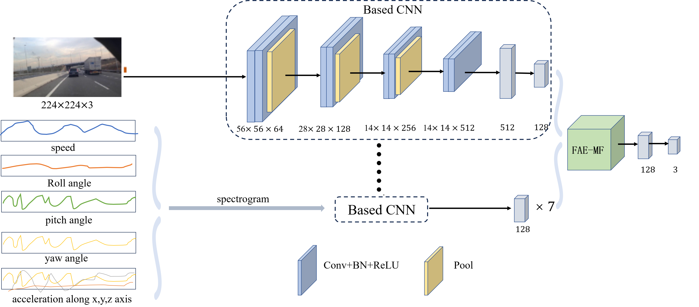
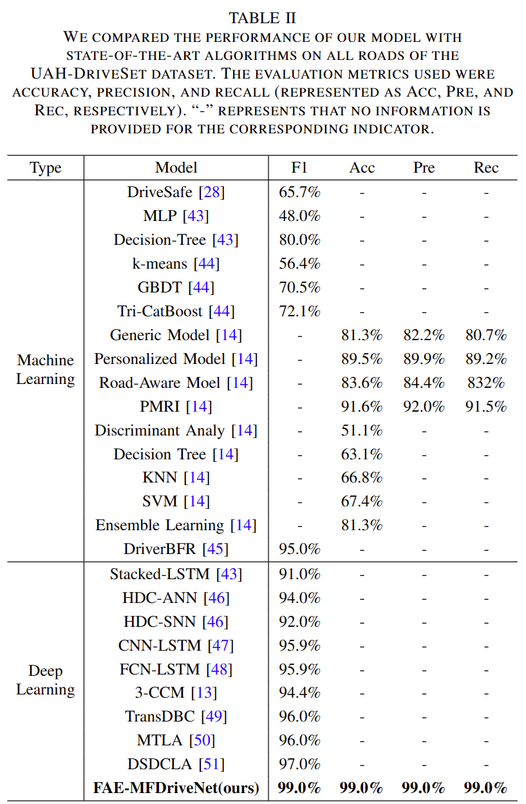
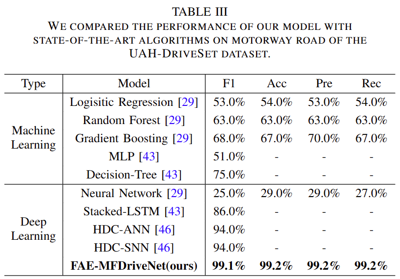
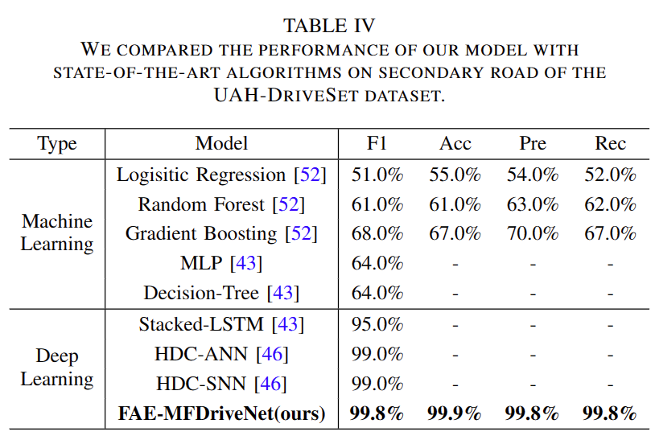

# **FAE-MFDriveNet: Feature Attention Embedding-based Multimodal Fusion Driving Behavior Prediction Network**



PyTorch implementation of the paper "FMDNet: Feature-attention-embedding-based Multimodal-fusion Driving-behavior-classification Network"


## **Changelog**


- [2023-07-05] Release the initial code for FAE-MFDriveNet.


## **Dataset processing**


#### **UAH-DriveSet dataset**

1.Origin UAH-DriveSet : This dataset is captured by DriveSafe, a driving monitoring application.The application is run by 6 different drivers and vehicles, performing 3 different driving behaviors (normal, drowsy and aggressive) on two types of roads (motorway and secondary road), resulting in more than 500 minutes of naturalistic driving with its associated raw data and processed semantic information, together with the video recordings of the trips. The UAH-DriveSet is available at: http://www.robesafe.com/personal/eduardo.romera/uah-driveset.

2.Processes UAH-DriveSet: First of all, since the UAH-DriveSet captures the roadside video during driving, we extract the last frame of every second from the video. Secondly, we interpolate the seven one-dimensional data in the RAW_GPS file, i.e. vehicle speed, turning angle and acceleration and expand it to 1260 data every second. Then merge the data of *x* seconds and the first four seconds into a txt file named *x.txt*, which corresponds to the last frame image *x.jpg* of x seconds. Please refer to: [Baidu Cloud link](https://pan.baidu.com/s/1BOK_4rewfofSY79V82muEg?pwd=44sX)


## **Quick Start**

#### 1.Environment configuration: Clone repo and install requirements.txt in a Python>=3.6.0 environment, including PyTorch>=1.7.

```
git clone https://github.com/liuwenzhuo1/FAE-MFDriveNet.git
pip install -r requirements.txt  # install
```

#### 2.train

```
python main.py --mode train
```

#### 3.test

```
python main.py --mode test
```

#### 4.result

Performance comparison with other driving behavior classification methods on experimental data of all roads. The Acc, Pre and Rec represent the accuracy, precision and recall. The "-" means that it is not indicated in the method.




Performance comparison with other driving behavior classification methods on experimental data of motorway road.




Performance comparison with other driving behavior classification methods on experimental data of secondary road.



## **Contribute**


Thanks to [Junbin Liao](https://github.com/BugBunnyBin) and [Jianli Lu](https://github.com/alu222) for their contributions to this code base.
